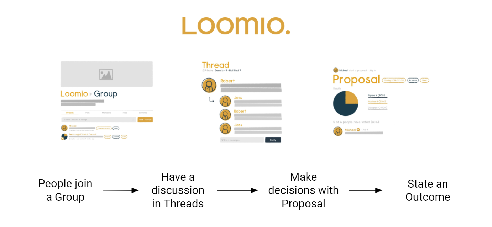
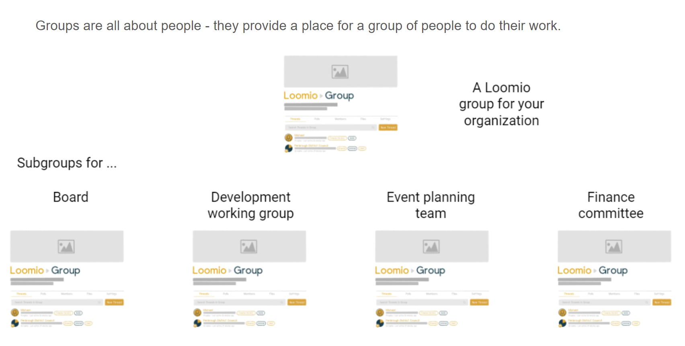

# What is Loomio and how can it help?

Loomio is a collaborative working space, shaped for making decisions — to achieve outcomes in line with your purpose.

<iframe width="608" height="380" src="https://www.youtube.com/embed/Zlzuqsunpxc" title="YouTube video player" frameborder="0" allow="accelerometer; autoplay; clipboard-write; encrypted-media; gyroscope; picture-in-picture" allowfullscreen></iframe>

## Key concepts

### Group

A Loomio group is a safe place for your organisation to meet, discuss and make decisions about work.

**Group home**
Your group home page is the first place you see when you arrive. It contains a title, an image to represent the group, and some text to introduce the group: its purpose, the work you will do, and any other information to help members participate.

**Subgroups**

Subgroups are a space for a smaller subset of people to focus on a project or program. 

Depending on the settings, the subgroup can be visible to the broader group, or for subgroup members' eyes only.

### Thread

Threads are where you share information, discuss, and make decisions.  

Threads are used for many purposes. In a board, you will use threads to prepare for a board meeting, discuss matters, share reports, ask questions, vote on resolutions, approve minutes, and so on. It's also where your group can develop a consensus or at least a shared understanding of issues important to you.

Threads keep everything about a topic in one place. Over time you’ll create a useful archive of your organisation’s discussions and decisions.

### Proposal

One of the best things about Loomio is its range of tools for gaining a clear view of where your group stands on any matter. Each tool has a slightly different purpose. The most common one is a proposal. 

A **proposal** is for converting a discussion into a clear, practical outcome. Someone suggests a course of action and invites everyone to respond. For example, you might ask group members to either:
- agree
- abstain or 
- disagree. 

Importantly, as well as selecting a response, everyone in the group has a chance to explain what prompted it. You can all see not just where everyone else stands on the matter, but why. And then, if you want, you can change your response. 

As well as helping your group to convert discussions into outcomes, a proposal creates its own record of how the decision came about.

### Other voting tools

A proposal is good for suggesting a particular path and gauging who wants to take it. But sometimes you might want group members to make a different kind of choice. 

Loomio offers a range of other poll tools:

- **Poll**: provide a list of options to find which one most people prefer
- **Check**: the online equivalent of asking everyone to (please) 'raise your hand if you…'
- **Time poll**: to determine the best time for the group to do something
- - **Score poll**: to express the strength of your preference for each option, using a numerical scale
- **Dot vote**: to express the strength of your preferences, with a constraint—you have a fixed number of ‘dots’ to allocate, and you can put all your dots in one place or spread them out
- **Ranked choice**: to rank a subset of options—useful for elections when there are many candidates and few seats
