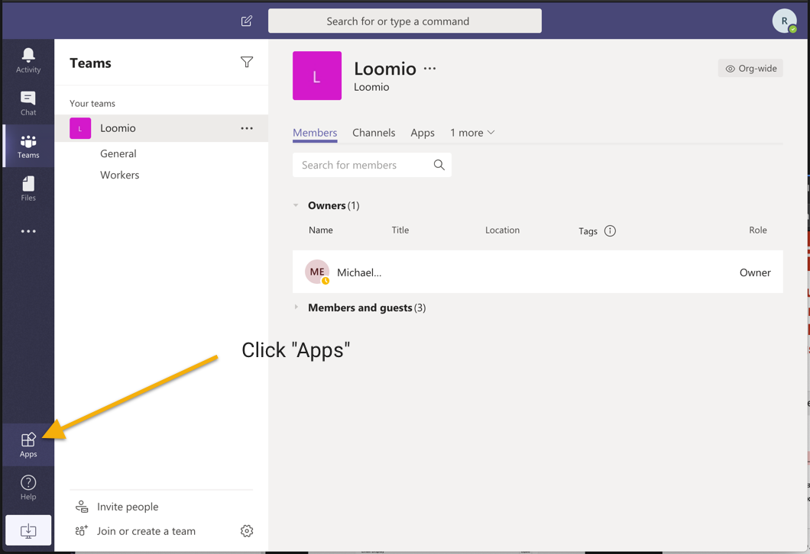
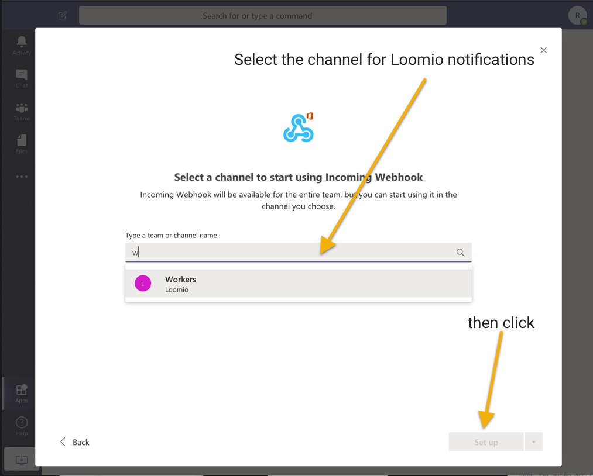
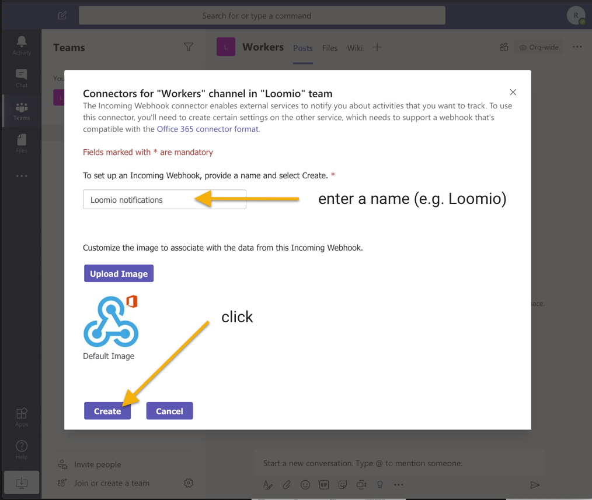
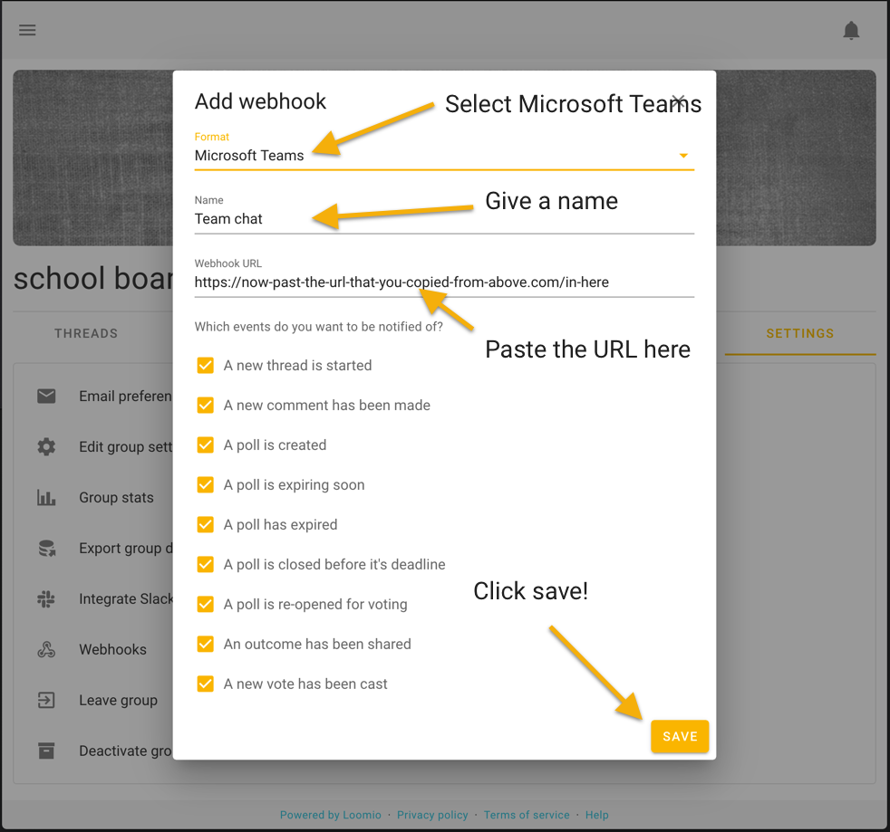

Loomio can send notifications into your Microsoft Teams when new discussions, proposals, comments, votes, and outcomes occur. Get key updates, at the right time, on important discussions and decisions.

After choosing where you want to receive notifications in Teams, and from which Loomio groups or subgroups, you will choose which kinds of events you want that channel to be notified of (comments, polls, outcomes... [see below](#select-notifications)). Read on for step-by-step instructions for integrating.

*These webhook integrations are currently in public beta testing, we would like to hear your [feedback](https://loomio.org/contact/?utm_campaign=teams-integration-help&utm_term=help) about how it works for your group.*

---

Visit [https://teams.microsoft.com](https://teams.microsoft.com) then click Apps

Search for "webhook" in the search field, then click Incoming Webhook

Click "Add to a team"

Type and select the channel you want Loomio notifications to appear within.

Give it a name, such as "Loomio notifications", then click "Create"

Copy the URL it gives you, you'll paste it into Loomio in the last step.

Go to your Loomio group Settings then click Webhooks

Select Microsoft Teams, give it a name, paste the URL, and click Save.

## Select notifications

Along with the ability to choose which events in Loomio will create a post in your chosen channel, you can also choose whether you'd like a snippet of the text from the comment, proposal, outcome, etc. by using the first option.

_Loomio is not created by, affiliated with, or supported by Microsoft._
